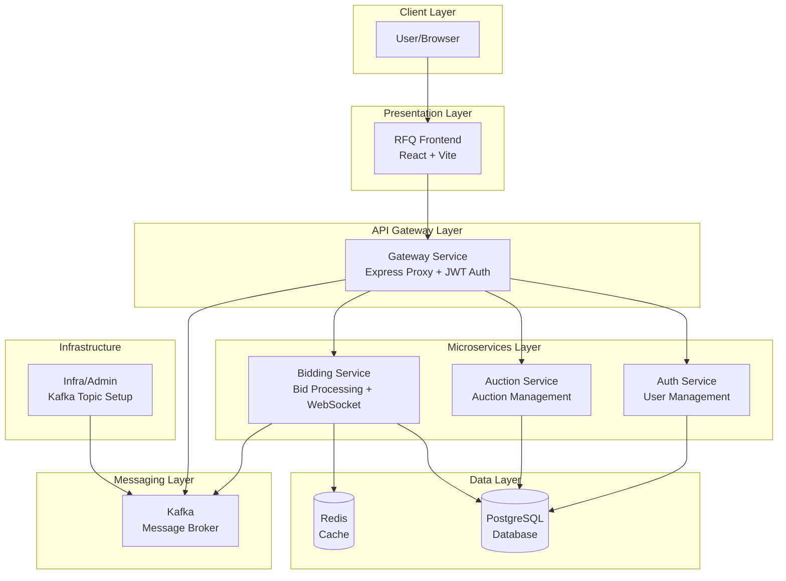
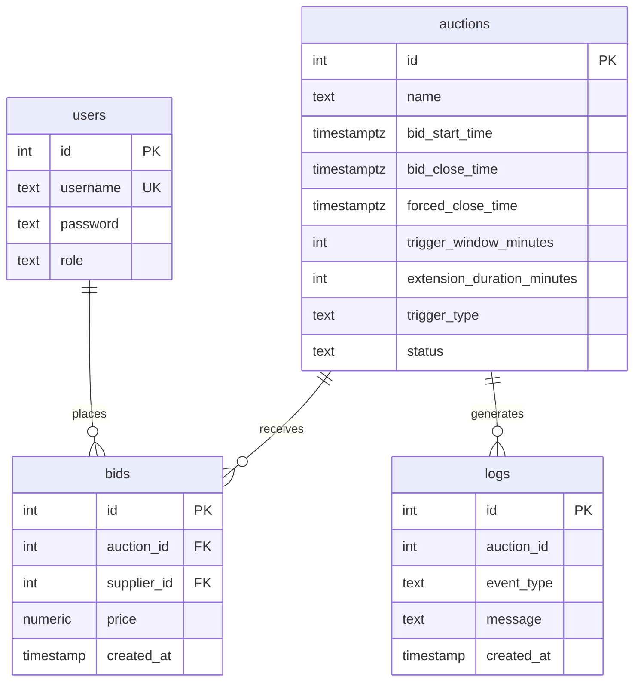

# GoComet Auction System

## High-Level Architecture



### Overview

This is a microservices-based auction system built with Node.js, featuring real-time bidding capabilities using WebSockets and Kafka for messaging. The system includes authentication, auction management, and bidding services, all orchestrated through an API gateway.

### Services

- **Auth Service**: Handles user authentication and authorization
- **Auction Service**: Manages auction creation and lifecycle
- **Bidding Service**: Processes bids in real-time with caching and messaging
- **Gateway Service**: API gateway for routing requests and JWT validation
- **Frontend**: React application for user interaction

### Infrastructure

- PostgreSQL for data persistence
- Redis for caching auction metadata and bids
- Kafka for event-driven communication
- Docker Compose for container orchestration

## Database Schema



## Challenges and Solutions

During the development of this British Auction system, two major challenges were encountered and addressed:

1. **Concurrency and Consistency in Bid Placement**: Ensuring that multiple bids could be processed simultaneously without data races or inconsistencies was critical. This was achieved by implementing a Kafka-based message queue system, where bid requests are queued and processed sequentially, preventing race conditions and maintaining data integrity across concurrent operations.

2. **Complex Trigger Logic for Auction Extensions**: The core logic for automatically extending auction times based on bidding activity within the trigger window required careful handling of three types of triggers: (a) any bid placed, (b) any rank change, and (c) lowest bidder change. An important edge case was identified where if the current time is close to the forced close time, extensions could potentially exceed the forced close limit, leading to bid rejection. This ensures the system provides a fair buffer for other suppliers while respecting the absolute deadline. The logic checks if extensions are possible before accepting bids, preventing invalid extensions beyond the forced close time.

## Getting Started (Run Locally)

### 1) Start services with Docker Compose

From the repo root, start all services defined in `docker-compose.yml`:

```bash
docker-compose up -d
```

> ✅ This will bring up the app services, PostgreSQL, Redis, and any other containers defined in the compose file.

### 2) Start Kafka + Zookeeper (standalone)

This project expects Kafka to be available. If you want to run Kafka/Zookeeper separately (outside of Docker Compose), you can run the official Confluent images.

First, start Zookeeper:

```bash
docker run -d --name zookeeper -p 2181:2181 \
  -e ZOOKEEPER_CLIENT_PORT=2181 \
  -e ZOOKEEPER_TICK_TIME=2000 \
  confluentinc/cp-zookeeper:7.2.1
```

Then start Kafka (replace `10.36.2.35` with your host IP if needed):

```bash
docker run -d --name kafka -p 9092:9092 \
  -e KAFKA_ZOOKEEPER_CONNECT=10.36.2.35:2181 \
  -e KAFKA_ADVERTISED_LISTENERS=PLAINTEXT://10.36.2.35:9092 \
  -e KAFKA_OFFSETS_TOPIC_REPLICATION_FACTOR=1 \
  confluentinc/cp-kafka:7.2.1
```

> ⚠️ Make sure `KAFKA_ADVERTISED_LISTENERS` points to an address that your services can reach (often the Docker host IP).

### 3) Install Node.js dependencies

Each service has its own `package.json`. Run `npm install` in each service folder you plan to run locally:

```bash
cd auth-service && npm install
cd auction-service && npm install
cd bidding-service && npm install
cd gateway-service && npm install
cd rfq-frontend-node && npm install
```

### 4) Start services (optional)

You can start each service manually using `npm start` (or the script defined in each `package.json`).

---
